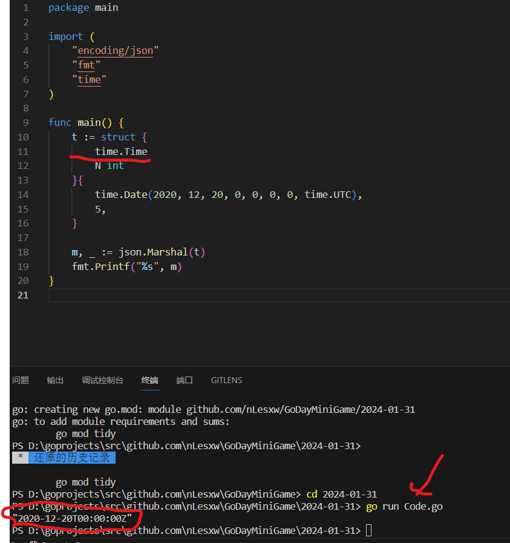
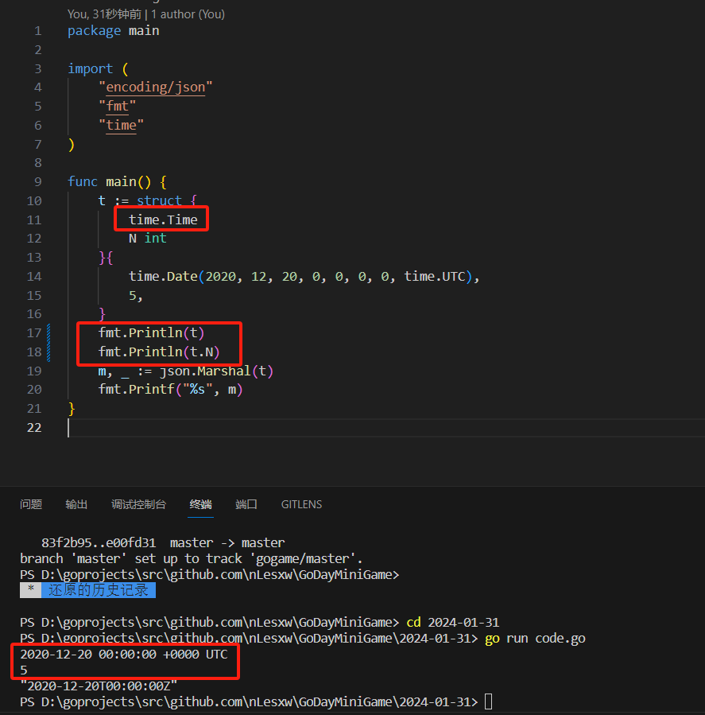
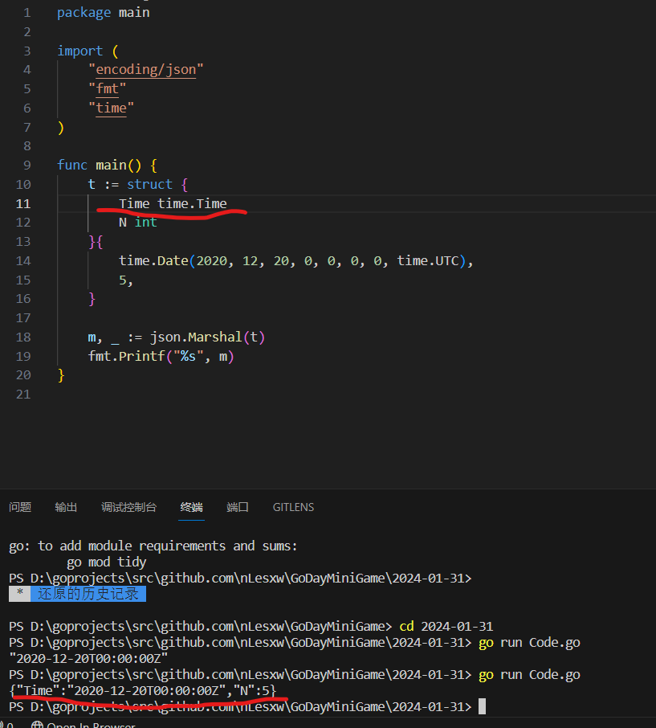
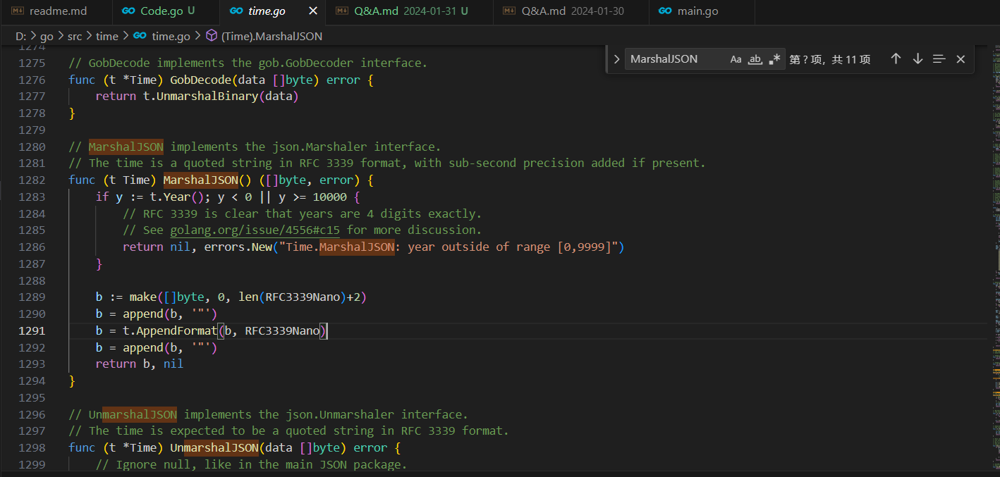
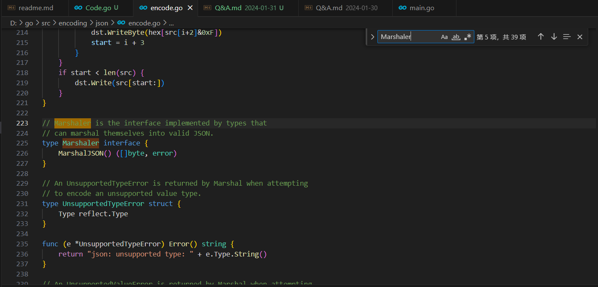

# Question:
**Code.go的输出会是什么？**
- A.`{"Time": "2020-12-20T00:00:00Z", "N": 5 }`
- B.`"2020-12-20T00:00:00Z"`
- C.`{"N": 5}`
- D.`<nil>`

# Answer:
**正确答案选择B**
先看运行结果

为什么不是A?因为代码中`time.Time`是内嵌到`t`中的。正是因为内嵌，t 的方法集包括了 time.Time 的方法集，所以，t 自动实现了 Marshaler 接口。通常通过内嵌来模拟继承的功能。

这里为什么不会打印N？是因为`time.Time`是内嵌的，在没指定输出`N`时，`t="2020-12-20T00:00:00Z"`如图：

如果在结构体中给`time.Time`设置一个变量，例如：`Time time.Time`。则答案选择A。

time包的MarshalJSON

json包的Marshaler
